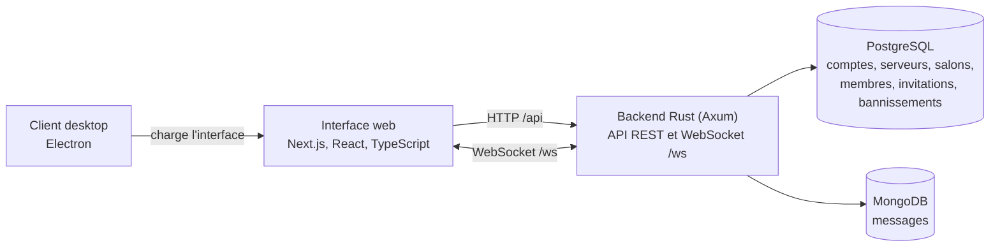

# EpiTalk

Plateforme de messagerie en temps réel inspirée de Discord : serveurs, salons, messages privés, rôles et modération. Backend en Rust (Axum), interface en Next.js, client desktop en Electron.

> **Contexte.** Projet d'équipe réalisé par quatre étudiants dans le cadre du cursus Epitech (2026). Ce dépôt est une copie du code du projet : l'historique détaillé de l'équipe n'y figure pas. Ma contribution personnelle est décrite ci-dessous ; le reste relève du travail collectif.

## Ma contribution

- API REST en Rust (Axum) : serveurs, salons, membres et invitations (validation, modèles, routes).
- Authentification JWT, hachage des mots de passe avec Argon2, middleware de protection des routes et contrôle d'accès par rôles (Owner, Admin, Moderator, Member).
- Schéma PostgreSQL, migrations SQL et jeu de données de test ; gestion des invitations (nombre d'utilisations, expiration, invitations actives).
- Intégration côté client du WebSocket et de l'historique MongoDB (chargement de l'historique au changement de salon).
- Composants React/Next.js : création de serveur et de salon, paramètres utilisateur ; harmonisation de l'interface et des fenêtres modales.
- Modération : bannissement permanent ou temporaire, interface associée, tests des permissions.
- Chaîne GitHub Actions (formatage, analyse statique, tests, couverture, images Docker) et son dépannage.
- Intégration des branches de l'équipe : fusions, résolution de conflits et d'erreurs de compilation.
- Documentation : API, protocole WebSocket, architecture, schéma relationnel, diagrammes UML.

Je ne revendique pas le hub WebSocket côté serveur, le client desktop Electron ni les fonctionnalités développées par les autres membres de l'équipe.

## Fonctionnalités présentes dans le code

- **Comptes et sécurité** : inscription, connexion, jetons JWT avec expiration et rafraîchissement, changement de mot de passe et d'e-mail, règles de complexité du mot de passe, profil (avatar, biographie, couleurs de bannière).
- **Serveurs et salons** : création, modification, suppression, transfert de propriété ; salons par serveur ; invitations avec limite d'utilisation et expiration.
- **Messagerie en temps réel** : messages instantanés par WebSocket, historique persistant (MongoDB), modification et suppression, messages programmés, messages épinglés, recherche dans un salon, pièces jointes (10 Mo maximum), réactions, GIF via une API externe (Tenor ou Giphy, clé requise), indicateurs de frappe, présence (en ligne, absent, ne pas déranger, hors ligne).
- **Messages privés** : conversations entre utilisateurs (envoi, modification, suppression).
- **Rôles et modération** : Owner, Admin, Moderator, Member ; expulsion ; bannissement permanent ou temporaire ; liste des bannissements.
- **Interface** : français et anglais, notifications, quatre thèmes (light, ash, dim, dark).
- **Client desktop** : fenêtre Electron qui charge l'interface web, avec notifications système et menu localisé.

## Architecture



## Stack technique

| Couche | Technologies |
|---|---|
| Backend | Rust (édition 2021), Axum 0.7, Tokio, SQLx 0.8, pilote MongoDB 2.8, jsonwebtoken, argon2, reqwest (API GIF) |
| Frontend | Next.js 16, React 19, TypeScript 5, Zustand, Tailwind CSS 4, Zod, Radix UI et shadcn/ui, Framer Motion |
| Bases de données | PostgreSQL 16 et MongoDB 6 (images Docker de `backend/docker-compose.yml`) |
| Desktop | Electron 32 |
| Qualité | rustfmt, Clippy, Vitest, GitHub Actions |

## Organisation du dépôt

```text
backend/                    API Rust : routes, modèles, dépôts, services, WebSocket, migrations SQL
frontend/real-time-chat/    Interface Next.js (App Router), stores Zustand, clients API et WebSocket
desktop-app/                Client Electron
docs/                       API (OpenAPI), architecture, protocole WebSocket, guides, diagrammes UML
.github/workflows/          CI, publication de l'image Docker, test d'intégration WebSocket
```

## Démarrage en local

Prérequis : Docker avec Compose, Node.js 20 ou plus, npm.

### 1. Configurer et lancer les bases de données

```bash
cd backend
cp .env.example .env
docker compose up -d
```

Cette commande démarre PostgreSQL (port 5433) et MongoDB (port 27017).

### 2. Créer le schéma PostgreSQL

`docker-compose.yml` n'applique automatiquement que `001_initial_schema.sql`, qui ne correspond plus au code. Le schéma de référence est `database/schema.sql` ; la table des bannissements est ajoutée par `004_add_bans.sql`.

```bash
docker compose exec -T postgres psql -U epitalk -d postgres -c "DROP DATABASE epitalk" -c "CREATE DATABASE epitalk"
docker compose exec -T postgres psql -U epitalk -d epitalk < database/schema.sql
docker compose exec -T postgres psql -U epitalk -d epitalk < database/migrations/004_add_bans.sql
```

Sous PowerShell, remplacez `< fichier` par `Get-Content fichier | docker compose exec -T postgres psql -U epitalk -d epitalk`.

### 3. Lancer le backend (port 3001)

```bash
docker compose --profile backend up -d --build
```

Sous Windows, les scripts `backend/scripts/*.sh` doivent conserver des fins de ligne LF (`git config core.autocrlf false` avant de cloner) : sinon le conteneur ne démarre pas.

Facultatif : pour la recherche de GIF, renseigner `TENOR_API_KEY` ou `GIPHY_API_KEY` dans `backend/.env`.

### 4. Lancer l'interface (port 8000)

```bash
cd ../frontend/real-time-chat
printf 'NEXT_PUBLIC_API_URL=http://localhost:3001\nNEXT_PUBLIC_WS_URL=ws://localhost:3001/ws\n' > .env.local
npm install --legacy-peer-deps
npm run dev
```

Sous PowerShell, créez `.env.local` avec ces deux lignes. L'option `--legacy-peer-deps` est nécessaire : `@emoji-mart/react` déclare une dépendance de pair sur des versions de React antérieures à la 19. L'interface est ensuite disponible sur <http://localhost:8000>.

### 5. Client desktop (facultatif)

```bash
cd ../../desktop-app
npm install
EPITALK_WEB_URL=http://localhost:8000 npm start
```

Sous PowerShell : `$env:EPITALK_WEB_URL="http://localhost:8000"; npm start`. Sans `EPITALK_WEB_URL`, le client charge `http://localhost:3000`.

## Tests

- Backend : `cd backend && cargo test -- --test-threads=1`, avec PostgreSQL et MongoDB démarrés (variables `DATABASE_URL` et `MONGO_URL`). Les tests couvrent notamment l'authentification, les messages, la présence, les indicateurs de frappe et le bannissement.
- Interface : `cd frontend/real-time-chat && npm test` (Vitest).
- Client desktop : `cd desktop-app && npm test` (Vitest).

Ces tests ne couvrent qu'une partie du code ; aucun taux de couverture n'est garanti.

## Intégration continue

Trois workflows GitHub Actions sont présents dans `.github/workflows/` :

- `ci.yml` : formatage (rustfmt), analyse statique (Clippy), compilation, tests avec PostgreSQL et MongoDB, couverture (cargo-llvm-cov, seuil de 70 % configuré) et audit des dépendances (RustSec).
- `deploy.yml` : construction et publication de l'image Docker du backend sur GitHub Container Registry. Les étapes de déploiement staging et production sont des squelettes, sans commande de déploiement réelle.
- `ws_test.yml` : test d'intégration WebSocket avec les deux bases de données.

## Documentation

- [API REST](docs/api/README.md) et [spécification OpenAPI](docs/api/openapi.yaml)
- [Protocole WebSocket](docs/websocket/protocol.md)
- [Architecture](docs/architecture/README.md)
- [Diagrammes UML](docs/uml/)

Certaines pages de `docs/` décrivent un état antérieur du projet (préfixe `/api/v1`, clés JWT RSA, guide de démarrage). Le code et `backend/docker-compose.yml` font foi, et ce README pour l'installation.

## Limites connues

- La dernière exécution de la CI sur `main` échoue (formatage rustfmt et audit RustSec) : les tests et la couverture n'y sont pas exécutés.
- Le déploiement staging et production n'est pas implémenté. L'environnement « staging » affiché par GitHub provient du squelette de workflow.
- Les migrations ne se rejouent pas telles quelles : trois fichiers portent le numéro `004`. `004_add_profile_fields.sql` échoue sur une base créée avec `001_initial_schema.sql` (la colonne `avatar_url` existe déjà) et `004_add_user_status.sql` crée un statut de type texte, alors que le code attend l'énumération `user_status`. D'où la procédure ci-dessus.
- Projet pédagogique : ne pas l'exposer tel quel sur Internet. Le fichier `.env.example` et `docker-compose.yml` contiennent des valeurs d'exemple (secret JWT, mot de passe de base de données).
- Le client desktop charge l'interface web dans une fenêtre native ; aucun installateur n'est fourni.

## Licence et crédits

Backend sous licence MIT (voir `backend/LICENSE`).

Fait avec ❤️ par l'équipe EpiTalk.
