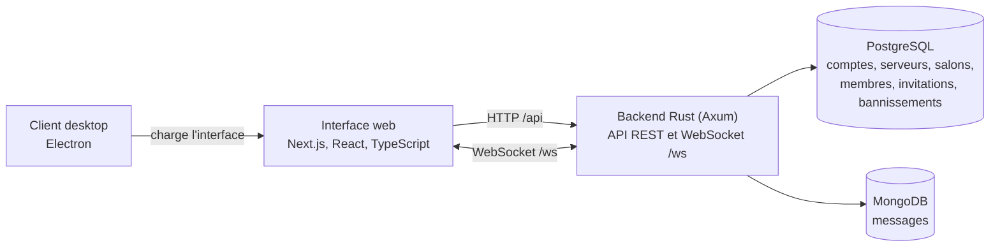

<div align="center">

# EpiTalk

**Messagerie en temps réel inspirée de Discord**

`Rust` `Axum` `Next.js` `PostgreSQL` `MongoDB` `WebSocket` `Electron`

</div>

> **Contexte.** Projet d'équipe de quatre personnes réalisé pendant ma formation (2026). Ce dépôt est une copie du code : l'historique détaillé de l'équipe n'y figure pas. Ma contribution personnelle est décrite ci-dessous ; le reste relève du travail collectif.

## Équipe et responsabilités

La répartition officielle comprend **14 branches fonctionnelles**. Chaque branche correspond à un ensemble cohérent de fonctionnalités, avec un responsable identifié.

| Participant | Branches | Responsabilité principale |
|:--|:--:|:--|
| **James** | 5 | Authentification, sessions et RBAC ; schéma PostgreSQL et migrations ; API REST serveurs/salons/membres ; CI, couverture et style ; spécifications REST/WS et documentation |
| **Daouda** | 3 | Repository MongoDB des messages ; hub WebSocket, diffusion, présence et frappe ; fonctionnalités supplémentaires |
| **Moïse** | 3 | Interface serveurs/salons et socle frontend, dont l'authentification ; interface membres/rôles ; présentation et démonstration |
| **Hadrian** | 3 | Interface chat et client WebSocket ; tests E2E des achievements ; initialisation des index MongoDB |

Le [référentiel des rôles, des 14 branches et des correspondances UML](docs/REPARTITION_ROLES_BRANCHES_UML.md) détaille les fonctionnalités, les achievements visés et les interfaces de collaboration. Le nommage est `feat/<scope>-<slug>/<owner>`, avec `owner` parmi `hadrian`, `moise`, `daouda`, `james` (sans accents).

Ces noms décrivent le découpage du projet d'origine ; cette copie publique ne republie pas ses 14 branches ni son historique complet. L'attribution d'un lot ne prouve pas à elle seule sa réalisation ou la validation de ses achievements.

## Ma contribution — James

Mon périmètre principal correspond aux cinq branches attribuées à James :

- `feat/backend-auth-rbac/james` : authentification, sessions, API de compte et contrôle d'accès par rôles Owner/Admin/Member ; socle Rust/Axum et middleware.
- `feat/db-postgres-schema-migrations/james` : schéma PostgreSQL, migrations, relations et contraintes d'intégrité.
- `feat/backend-servers-channels-members/james` : API REST des serveurs, salons, membres, rôles et invitations ; permissions et repositories PostgreSQL.
- `feat/ci-coverage-style/james` : chaîne de qualité backend/frontend, lint, tests et objectif de couverture d'au moins 70 %.
- `feat/docs-api-ws-specs/james` : OpenAPI, protocole WebSocket, architecture PostgreSQL/MongoDB et documentation d'accueil.

J'ai également contribué à l'intégration des branches (fusions, conflits et compilation), au branchement du WebSocket et de l'historique MongoDB dans le client, à des composants et ajustements React/Next.js, ainsi qu'aux évolutions de modération (Moderator, bannissements et tests de permissions). Ces contributions transverses complètent la répartition : le hub WebSocket et le repository MongoDB relèvent de Daouda, le chat temps réel d'Hadrian et le socle de l'interface de Moïse. Le client desktop Electron reste une réalisation collective sans attribution personnelle à James dans ce référentiel.

Les mots de passe du code actuel sont hachés avec Argon2. Le rôle Moderator est une évolution du socle initial Owner/Admin/Member. Le seuil de couverture reste un objectif, sans résultat mesuré attesté ici.

## Fonctionnalités présentes dans le code

| Domaine | Fonctionnalités |
|:--|:--|
| **Comptes et sécurité** | Inscription, connexion, jetons JWT (expiration, rafraîchissement), changement de mot de passe et d'e-mail, règles de complexité du mot de passe, profil (avatar, biographie, couleurs de bannière) |
| **Serveurs et salons** | Création, modification, suppression, transfert de propriété · salons par serveur · invitations à usage limité et expirantes |
| **Messagerie temps réel** | WebSocket, historique persistant (MongoDB), modification et suppression, messages programmés et épinglés, recherche dans un salon, pièces jointes (10 Mo maximum), réactions, GIF (Tenor ou Giphy, clé requise), indicateurs de frappe, présence (en ligne, absent, ne pas déranger, hors ligne) |
| **Messages privés** | Conversations entre utilisateurs : envoi, modification, suppression |
| **Rôles et modération** | Owner, Admin, Moderator, Member · expulsion · bannissement permanent ou temporaire · liste des bannissements |
| **Interface** | Français et anglais · notifications · quatre thèmes (light, ash, dim, dark) |
| **Client desktop** | Fenêtre Electron qui charge l'interface web, avec notifications système et menu localisé |

## Architecture



## Stack technique

| Couche | Technologies |
|:--|:--|
| **Backend** | Rust (édition 2021), Axum 0.7, Tokio, SQLx 0.8, pilote MongoDB 2.8, jsonwebtoken, argon2, reqwest (API GIF) |
| **Frontend** | Next.js 16, React 19, TypeScript 5, Zustand, Tailwind CSS 4, Zod, Radix UI et shadcn/ui, Framer Motion |
| **Bases de données** | PostgreSQL 16 et MongoDB 6 (images Docker de `backend/docker-compose.yml`) |
| **Desktop** | Electron 32 |
| **Qualité** | rustfmt, Clippy, Vitest |

## Organisation du dépôt

```text
backend/                    API Rust : routes, modèles, dépôts, services, WebSocket, migrations SQL
frontend/real-time-chat/    Interface Next.js (App Router), stores Zustand, clients API et WebSocket
desktop-app/                Client Electron
docs/                       API (OpenAPI), architecture, protocole WebSocket, guides, diagrammes UML
```

<details>
<summary><b>Démarrage en local</b> : Docker, PostgreSQL, MongoDB, Next.js</summary>

Prérequis : Docker avec Compose, Node.js 20 ou plus, npm.

### 1. Configurer et lancer les bases de données

```bash
cd backend
cp .env.example .env
docker compose up -d
```

Cette commande démarre PostgreSQL (port 5433) et MongoDB (port 27017).

### 2. Créer le schéma PostgreSQL

`docker-compose.yml` n'applique automatiquement que `001_initial_schema.sql`, qui ne correspond plus au code. Le schéma de référence est `database/schema.sql` ; la table des bannissements est ajoutée par `004_add_bans.sql`.

```bash
docker compose exec -T postgres psql -U epitalk -d postgres -c "DROP DATABASE epitalk" -c "CREATE DATABASE epitalk"
docker compose exec -T postgres psql -U epitalk -d epitalk < database/schema.sql
docker compose exec -T postgres psql -U epitalk -d epitalk < database/migrations/004_add_bans.sql
```

Sous PowerShell, remplacez `< fichier` par `Get-Content fichier | docker compose exec -T postgres psql -U epitalk -d epitalk`.

### 3. Lancer le backend (port 3001)

```bash
docker compose --profile backend up -d --build
```

Sous Windows, les scripts `backend/scripts/*.sh` doivent conserver des fins de ligne LF (`git config core.autocrlf false` avant de cloner) : sinon le conteneur ne démarre pas.

Facultatif : pour la recherche de GIF, renseigner `TENOR_API_KEY` ou `GIPHY_API_KEY` dans `backend/.env`.

### 4. Lancer l'interface (port 8000)

```bash
cd ../frontend/real-time-chat
printf 'NEXT_PUBLIC_API_URL=http://localhost:3001\nNEXT_PUBLIC_WS_URL=ws://localhost:3001/ws\n' > .env.local
npm install --legacy-peer-deps
npm run dev
```

Sous PowerShell, créez `.env.local` avec ces deux lignes. L'option `--legacy-peer-deps` est nécessaire : `@emoji-mart/react` déclare une dépendance de pair sur des versions de React antérieures à la 19. L'interface est ensuite disponible sur <http://localhost:8000>.

### 5. Client desktop (facultatif)

```bash
cd ../../desktop-app
npm install
EPITALK_WEB_URL=http://localhost:8000 npm start
```

Sous PowerShell : `$env:EPITALK_WEB_URL="http://localhost:8000"; npm start`. Sans `EPITALK_WEB_URL`, le client charge `http://localhost:3000`.

</details>

## Tests

- **Backend** : `cd backend && cargo test -- --test-threads=1`, avec PostgreSQL et MongoDB démarrés (variables `DATABASE_URL` et `MONGO_URL`). Les tests couvrent notamment l'authentification, les messages, la présence, les indicateurs de frappe et le bannissement.
- **Interface** : `cd frontend/real-time-chat && npm test` (Vitest).
- **Client desktop** : `cd desktop-app && npm test` (Vitest).

Ces tests ne couvrent qu'une partie du code ; aucun taux de couverture n'est garanti.

## Documentation

- [Rôles des participants, 14 branches et correspondances UML](docs/REPARTITION_ROLES_BRANCHES_UML.md)
- [Index des branches](backend/BRANCHES.md)
- [API REST](docs/api/README.md) et [spécification OpenAPI](docs/api/openapi.yaml)
- [Protocole WebSocket](docs/websocket/protocol.md)
- [Architecture](docs/architecture/README.md)
- [Diagrammes UML et attribution des composants](docs/uml/README.md)

Certaines pages de `docs/` décrivent un état antérieur du projet (préfixe `/api/v1`, clés JWT RSA). Le code et `backend/docker-compose.yml` font foi, et ce README pour l'installation.

## Limites connues

- Les migrations ne se rejouent pas telles quelles : trois fichiers portent le numéro `004`. `004_add_profile_fields.sql` échoue sur une base créée avec `001_initial_schema.sql` (la colonne `avatar_url` existe déjà) et `004_add_user_status.sql` crée un statut de type texte, alors que le code attend l'énumération `user_status`. D'où la procédure ci-dessus.
- Le déploiement staging et production n'est pas implémenté : l'environnement « staging » affiché par GitHub provient d'un squelette de workflow.
- Projet pédagogique : ne pas l'exposer tel quel sur Internet. Le fichier `.env.example` et `docker-compose.yml` contiennent des valeurs d'exemple (secret JWT, mot de passe de base de données).
- Le client desktop charge l'interface web dans une fenêtre native ; aucun installateur n'est fourni.

## Licence et crédits

Backend sous licence MIT (voir `backend/LICENSE`).

Fait avec ❤️ par l'équipe EpiTalk.
